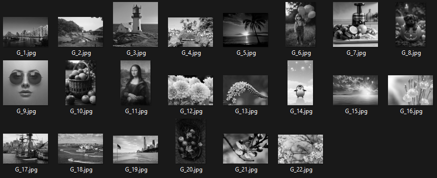
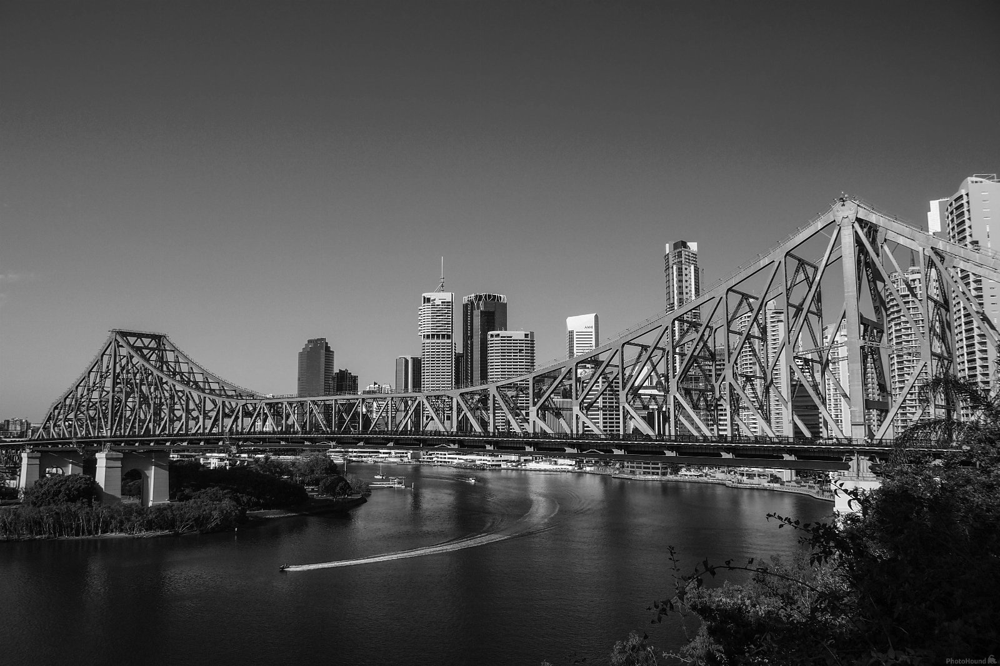
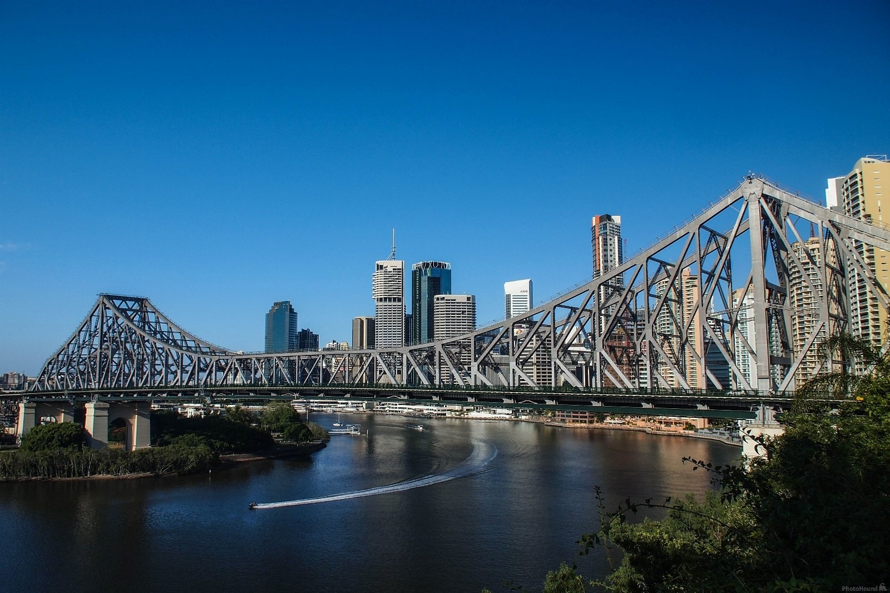
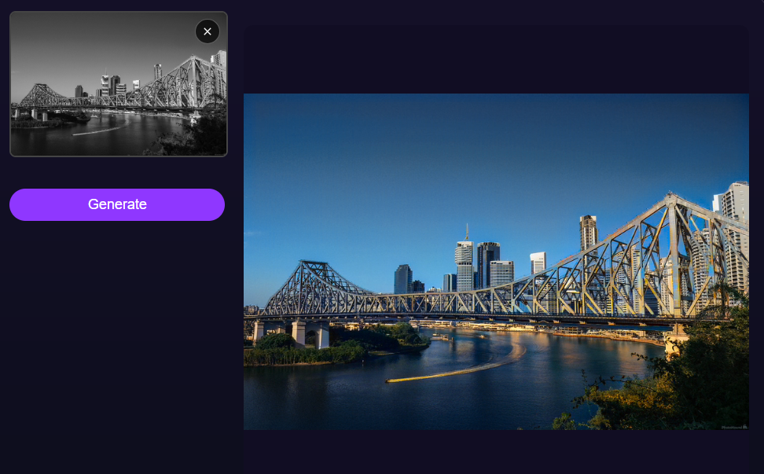

# Pattern Analysis

# COMP3710 (University of Queensland) — Grayscale to Color Image Colorization Model Test Dataset  



This repository contains a curated dataset used for testing grayscale-to-color image colorization models developed in COMP3710. 
The dataset includes a mix of AI-generated and publicly sourced images, selected to support academic experimentation and model evaluation.

> ⚠️ **Usage Notice**  
This dataset is intended strictly for private academic use. All images are subject to the rights and ownership of their respective copyright holders. Redistribution or commercial use is not permitted.

### Dataset Details

- Each grayscale image was generated using OpenCV:
  ```python
  cv2.cvtColor(img, cv2.COLOR_BGR2GRAY)

- Folder structure
```bash
├── test-dataset
      ├── G_1.jpg
      ├── G_2.jpg
      ├── G_3.jpg
```


### Colorization Sample

- Below is `G_1.jpg` and its intended (original) color image:  
    
  

- Below is a colorization result based on an Internet-sourced image (name withheld):  
  
  
### Your Task

Use the fine-tuned **Mamba** model to colorize the grayscale images provided in this dataset.
A **perceptual realism test** will be used to evaluate the results — assessing whether the generated colors appear realistic to a human observer.

> ⚠️ **Note**  
Not all grayscale images can be accurately colorized, especially in the absence of visual cues, contextual information, or semantic understanding. This is expected and considered normal for edge cases.


